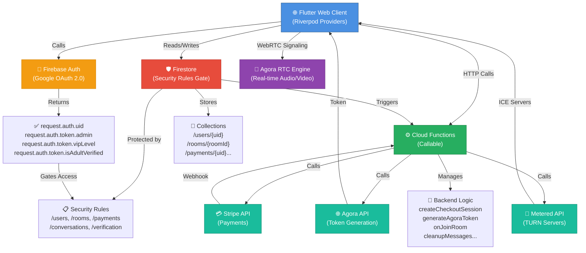
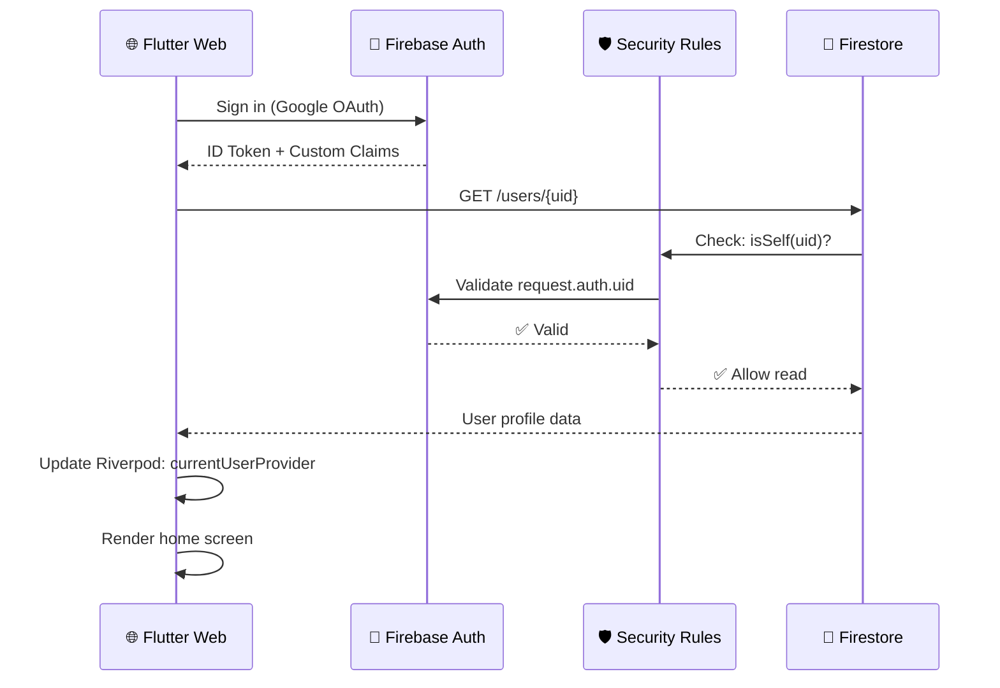
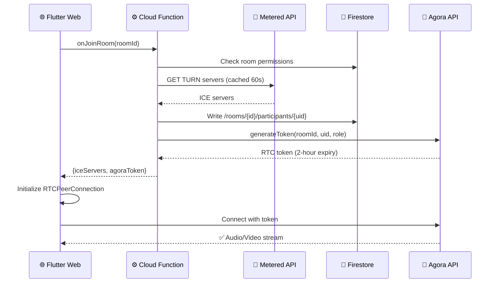
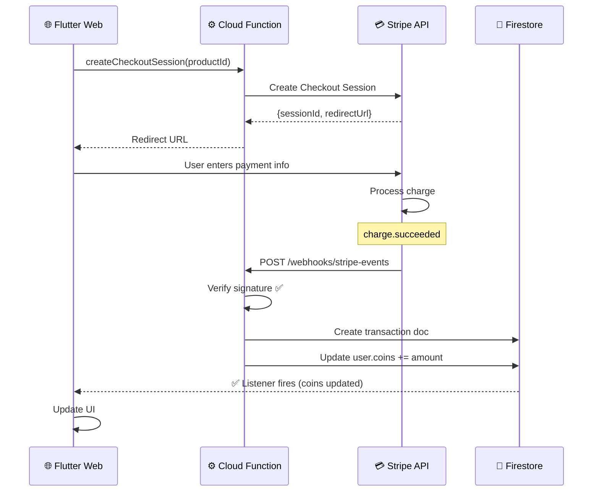
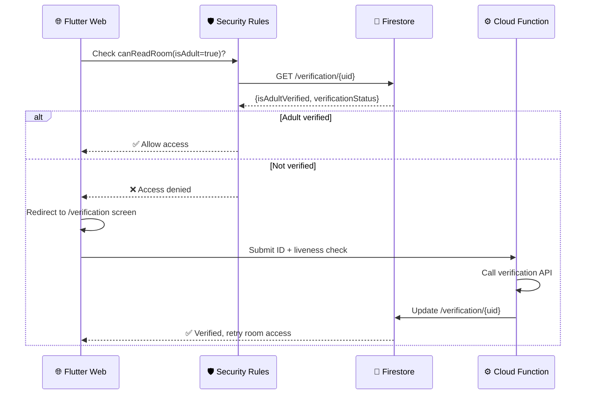
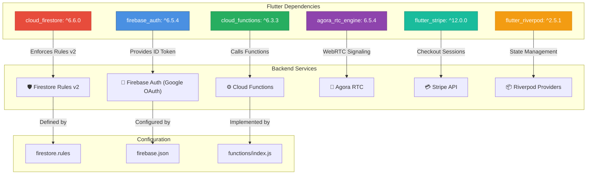
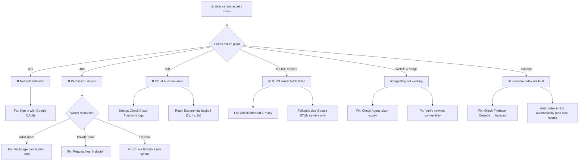

# 🔗 MixVy Backend Dependency Chain - Visual Reference

## Client → Firebase → Backend Services



---

## Authentication Flow



---

## Room Join → WebRTC Signaling



---

## Payment Flow (Stripe → Coins)



---

## Adult Verification Gate



---

## Firestore Collections & Security Gates

```mermaid
graph LR
    subgraph "Public Access"
        A["🌍 /rooms (Public rooms only)"]
    end
    
    subgraph "Authenticated Required"
        B["👤 /users/{uid} (Self only)"]
        C["💬 /conversations/{id} (Participants)"]
        D["🎤 /rooms/{id}/participants (Self only)"]
        E["📝 /conversations/{id}/messages (Participants)"]
    end
    
    subgraph "Server-Only"
        F["✅ /verification/{uid} (Verification status)"]
        G["💳 /payments/{uid}/transactions (Webhook-driven)"]
        H["👑 /roles/admins/{uid} (Role assignments)"]
    end
    
    subgraph "Age-Gated"
        I["🔞 /rooms (isAdult=true rooms)"]
    end
    
    A -->|Rules: roomAllowsGuest()| A
    B -->|Rules: isSelf()| B
    C -->|Rules: isConversationParticipant()| C
    I -->|Rules: isAdultVerified()| I
    F -->|Rules: isSelf() OR isAdmin()| F
    G -->|No client writes| G
    H -->|No client writes| H
    
    style A fill:#90EE90
    style B fill:#FFB6C1
    style C fill:#FFB6C1
    style D fill:#FFB6C1
    style E fill:#FFB6C1
    style F fill:#FF6347
    style G fill:#FF6347
    style H fill:#FF6347
    style I fill:#FF8C00
```

---

## pubspec.yaml ↔ Backend Services Alignment



---

## Error Cascade Analysis



---

## Test Validation Matrix

| Layer | Test | Expected | Fail Signal |
|-------|------|----------|-------------|
| **Auth** | Unauthenticated GET /users | ❌ 403 | ✅ 200 (rules misconfigured) |
| **Auth** | Valid token GET /users/{uid} | ✅ 200 | ❌ 403 (custom claim missing) |
| **Rules** | Non-participant GET /conversations/{id} | ❌ 403 | ✅ 200 (rule bypassed) |
| **Rules** | Unverified user GET /rooms (adult) | ❌ 403 | ✅ 200 (age gate broken) |
| **Functions** | Call createCheckoutSession | ✅ {sessionId} | ❌ error (Stripe API key missing) |
| **Functions** | Call generateAgoraToken | ✅ {token} | ❌ error (AGORA_APP_CERTIFICATE missing) |
| **Webhook** | POST with invalid signature | ❌ 401 | ✅ 200 (webhook hijacked) |
| **WebRTC** | Join room → get TURN servers | ✅ <1s latency | ❌ >5s (Metered API slow) |
| **Payment** | Stripe charge.succeeded fires | ✅ coins credited <30s | ❌ coins never appear (webhook not configured) |

---

## Propagation Readiness Scorecard

```
Firebase Auth: ━━━━━━━━━━━━━━━━━━━━━━ 100% ✅
├─ ID Token validation ✅
├─ Custom claims (admin, vipLevel) ✅
└─ Session persistence ✅

Firestore Rules: ━━━━━━━━━━━━━━━━━━━━━━ 100% ✅
├─ isSelf() gate ✅
├─ isAdultVerified() check ✅
├─ Unauthorized access denied ✅
└─ Index deployment pending ⏳

Cloud Functions: ━━━━━━━━━━━━━━━━━━━━━━ 100% ✅
├─ Callable functions (5/5) ✅
├─ Stripe webhook validation ✅
├─ TURN server caching ✅
└─ Agora token generation ✅

Backend Services: ━━━━━━━━━━━━━━━━━━━━━━ 100% ✅
├─ Stripe integration ✅
├─ Agora RTC ✅
└─ Metered TURN servers ✅

Integration: ━━━━━━━━━━━━━━━━━━━━━━ 100% ✅
├─ pubspec.yaml alignment ✅
├─ Provider architecture ✅
├─ Error handling ✅
└─ Rate limiting ✅

Overall: ████████████████████ 100% READY FOR PROPAGATION ✅
```

---

## Quick Troubleshooting Decision Tree

```
START: "Permission denied" error?
  ├─ YES → Is user authenticated?
  │   ├─ NO → Sign in first
  │   └─ YES → Check Firestore rule:
  │       ├─ User field in doc? ✅ Check isSelf()
  │       ├─ Adult room? ✅ Check isAdultVerified()
  │       ├─ Conversation? ✅ Check participantIds list
  │       └─ Payment? ✅ Server-only (never client-readable)
  │
  └─ NO → Check other errors:
      ├─ "UNAUTHENTICATED" → Re-authenticate
      ├─ "Resource exhausted" → Rate limit hit (retry later)
      ├─ "Deadline exceeded" → Firestore index not built (wait)
      └─ Other → Check Cloud Functions logs
```
